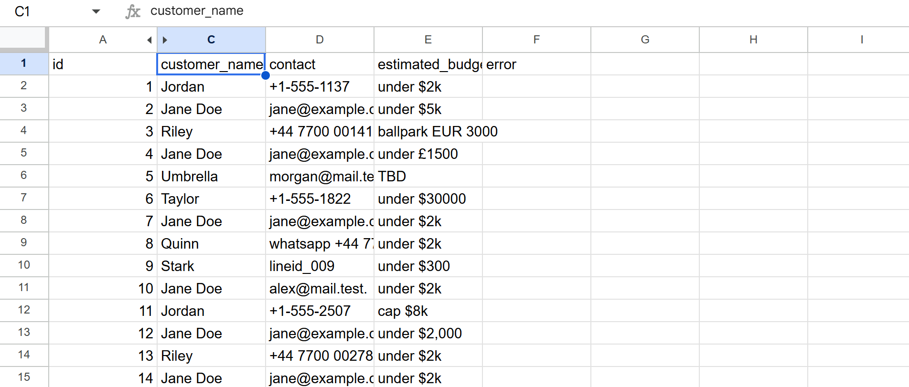

# Inquiry Mail Extractor (LLM + Pydantic)

[](https://github.com/Lucien0420/LLM-Tool-Use/actions/workflows/ci.yml)

**Repository:** [github.com/Lucien0420/LLM-Tool-Use](https://github.com/Lucien0420/LLM-Tool-Use)

## Overview

**Inquiry Mail Extractor** is a Python CLI that reads **unstructured customer inquiry text** (email body, pasted messages) and extracts **structured fields** using an **OpenAI-compatible API** (local **Ollama** or cloud). Outputs are validated with **Pydantic** and written as **JSON** or **CSV** (UTF-8 with BOM for Excel).

### Core Features

- **Structured fields**: `customer_name`, `contact`, `estimated_budget`
- **JSON mode** with fallback when the backend does not support `response_format`
- **Single message** CLI + optional JSON file output
- **Batch `.txt` → CSV**: one text file per inquiry; errors per row without stopping the run
- **CSV → CSV**: spreadsheet with a message column (default `body`); original columns preserved, extraction columns appended
- **One-shot runner** (`demo.py`): lint + tests + optional LLM smoke (see Demo)

### Use Cases

- Normalizing inbound sales or support inquiries before CRM entry
- Batch-processing exported mail or spreadsheet rows
- Portfolio / interview demos with local or hosted LLMs

### Design

- **Layered layout**: `app/core` (config), `app/schemas` (Pydantic), `app/services` (extraction, batch/CSV)
- **Same client stack** for Ollama and cloud: change `LLM_BASE_URL` and credentials in `.env`

---

## Quick Start

### Option 1: Local (recommended for development)

```bash
python -m venv .venv
.venv\Scripts\activate   # Windows
# macOS/Linux: source .venv/bin/activate
pip install -e ".[dev]"
copy .env.example .env   # Windows — set LLM_MODEL to match `ollama list`
```

### Option 2: Docker

```bash
docker build -t llm-tool-use .
docker run --rm --env-file .env llm-tool-use
```

Ollama on the host is not reachable as `127.0.0.1` from inside the container. On Docker Desktop, point the API at the host, for example:

```bash
docker run --rm -e LLM_BASE_URL=http://host.docker.internal:11434/v1 -e LLM_MODEL=llama3.2:1b llm-tool-use python scripts/run_extract.py -t "test budget $100"
```

---

## Demo

### 1. Automated checks (no LLM)

```bash
python demo.py all
```

Runs **Ruff**, **pytest**, and **`main.py`** (config print). Same as CI logic without GitHub.

### 2. LLM smoke (requires Ollama or compatible API)

```bash
python demo.py llm
```

Runs one single-message extract, batch folder extract, and CSV extract (**first 5 rows**). Writes `output/demo_batch.csv` and `output/demo_from.csv`.

### 3. Manual CLI (same behavior, full control)

```bash
python main.py
python scripts/run_extract.py -t "Hi, I'm John. Budget $500. john@example.com"
python scripts/batch_extract.py -i samples -o output/batch.csv
python scripts/csv_extract.py -i samples/inquiries.csv -o output/from_csv.csv
```

Use `--limit N` on `csv_extract.py` for partial runs. Regenerate sample CSV: `python scripts/generate_inquiries_sample.py -n 50 -o samples/inquiries.csv`.

### 4. Visual example (input → output)

Order follows the **pipeline**: what you feed in, then what you get after `csv_extract`.

1. **Input** — **`samples/inquiries.csv`** in a **text editor**: columns `id` and `body` (raw inquiry text). This is the `-i` file for `scripts/csv_extract.py`.
2. **Output** — Result written by `csv_extract` (e.g. `output/from_csv.csv`) opened in **Google Sheets**: extracted fields such as `customer_name`, `contact`, `estimated_budget`.




### 5. Unit tests

```bash
pytest tests/ -v
```

---

## Environment Variables

| Variable | Local Ollama | Cloud (e.g. OpenAI) |
|----------|----------------|----------------------|
| `LLM_BASE_URL` | `http://127.0.0.1:11434/v1` | `https://api.openai.com/v1` |
| `OPENAI_API_KEY` | empty or placeholder | your API key |
| `LLM_MODEL` | e.g. `llama3.2:1b` | e.g. `gpt-4o-mini` |

---

## CI (GitHub Actions)

On push or pull request to `main` / `master`, `.github/workflows/ci.yml` runs **Ruff** and **pytest** on Python **3.10–3.12**. Tests mock the LLM; no API key or Ollama required. The badge above reflects the latest run on the default branch after code is pushed.

---

## Project Structure

```
├── app/
│   ├── api/          # reserved (future HTTP layer)
│   ├── core/         # settings from .env
│   ├── database/     # reserved
│   ├── models/       # reserved
│   ├── schemas/      # Pydantic models
│   ├── services/     # extraction, batch CSV, CSV pipeline
│   └── utils/
├── docs/
│   └── screenshots/  # README visual examples (input / output PNGs)
├── samples/          # example .txt and inquiries.csv
├── scripts/          # CLI entry points, sample generators
├── output/           # suggested folder for generated CSV/JSON (contents gitignored)
├── tests/
├── demo.py           # one entry for checks + optional LLM smoke
├── main.py
├── Dockerfile
├── pyproject.toml
└── requirements.txt
```

---

## Notes

- Smaller models (e.g. 1B) may hallucinate or mis-fill fields; larger models or cloud APIs improve accuracy for production.
- Prompts are in English; inquiry text may be any language.

## Possible extensions

- `.xlsx` export (`openpyxl`)
- FastAPI `/extract` or a small Gradio/Streamlit UI
- Row validation (email/phone regex) + optional `warning` column

---

## License

MIT License — see [LICENSE](LICENSE) for details.
